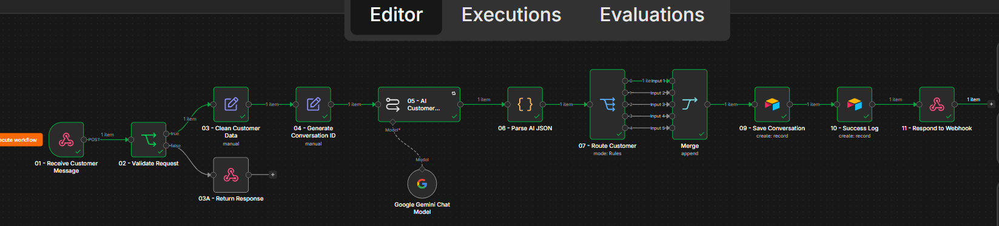
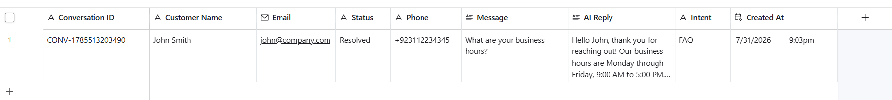
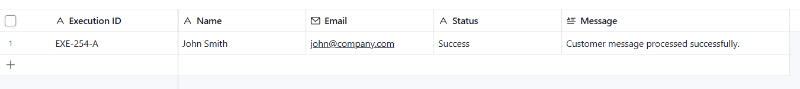

# 💬 AI Customer Support Assistant

An AI-powered customer support workflow built with **n8n**, **Google Gemini**, **Airtable**, and **Webhooks**. The system automatically receives customer messages, analyzes their intent using AI, generates professional responses, stores conversations, and logs workflow executions for monitoring.

---

## 🚀 Features

- 💬 Receives customer messages via Webhook
- ✅ Validates required customer information
- 🧹 Cleans and normalizes customer data
- 🆔 Generates a unique Conversation ID
- 🤖 Uses Google Gemini to classify customer intent
- ✨ Generates intelligent AI-powered responses
- 🔀 Routes conversations based on intent
- 🗂️ Stores conversations in Airtable
- 📊 Logs workflow executions for monitoring
- ⚡ Fully automated end-to-end customer support workflow

---

## 🏗️ Workflow Architecture

```text
Webhook
      │
      ▼
Validate Request
      │
      ▼
Clean Customer Data
      │
      ▼
Generate Conversation ID
      │
      ▼
AI Customer Support (Google Gemini)
      │
      ▼
Parse AI JSON
      │
      ▼
Route Customer (Switch)
      │
      ▼
Save Conversation (Airtable)
      │
      ▼
Log Workflow Execution
      │
      ▼
Respond to Webhook
```

---

## 🤖 AI Capabilities

The AI assistant can automatically:

- Answer frequently asked questions
- Classify customer intent
- Detect sales opportunities
- Identify support requests
- Escalate complex conversations
- Generate natural, professional responses

Supported Intent Types:

- FAQ
- Lead
- Support
- Complaint
- Human Escalation

---

## 🛠️ Tech Stack

- n8n
- Google Gemini
- Airtable
- Webhooks
- HTTP Request
- JavaScript
- REST APIs
- AI Automation

---

## 📂 Airtable Structure

### Conversations

| Field |
|--------|
| Conversation ID |
| Customer Name |
| Email |
| Phone |
| Message |
| AI Reply |
| Intent |
| Status |
| Created At |

---

### Workflow Executions

| Field |
|--------|
| Execution ID |
| Workflow |
| Status |
| Message |
| Timestamp |

---

## 📸 Screenshots

### Workflow



```
screenshots/workflow.png
```

### Conversations Table



```
screenshots/conversations-table.png
```

### Workflow Executions



```
screenshots/workflow-executions.png
```

---

## 🎥 Demo

This project demonstrates:

- Receiving customer messages via Webhook
- AI intent classification using Google Gemini
- Automatic response generation
- Conversation storage in Airtable
- Workflow execution logging
- Returning JSON responses to the client

---

## 💼 Business Use Cases

- Customer Support Teams
- SaaS Companies
- E-commerce Stores
- Healthcare Clinics
- Law Firms
- Real Estate Agencies
- Marketing Agencies
- Consulting Businesses
- Online Service Providers

---

## 🔮 Future Improvements

- WhatsApp Business integration
- Live Chat widget integration
- Email support automation
- RAG-powered knowledge base
- Pinecone vector database
- Sentiment analysis
- Multi-language support
- Slack notifications for escalations
- CRM integration
- Customer satisfaction tracking

---

## 📁 Project Structure

```
ai-customer-support-assistant/
│
├── README.md
├── workflow.json
├── LICENSE
├── .gitignore
└── screenshots/
    ├── workflow.png
    ├── conversations-table.png
    └── workflow-executions.png
```

---

## 🔒 Security

Sensitive credentials such as API keys, OAuth tokens, and service account files are **not included** in this repository. The workflow uses secure credential management provided by n8n.

---

## 👨‍💻 Author

**Ayman Amjad**

Software Engineer | AI Automation Developer

Specializing in:

- AI Automation
- n8n Workflows
- AI Agents
- Customer Support Automation
- Business Process Automation

---

## ⭐ If you found this project useful, consider giving it a Star!
